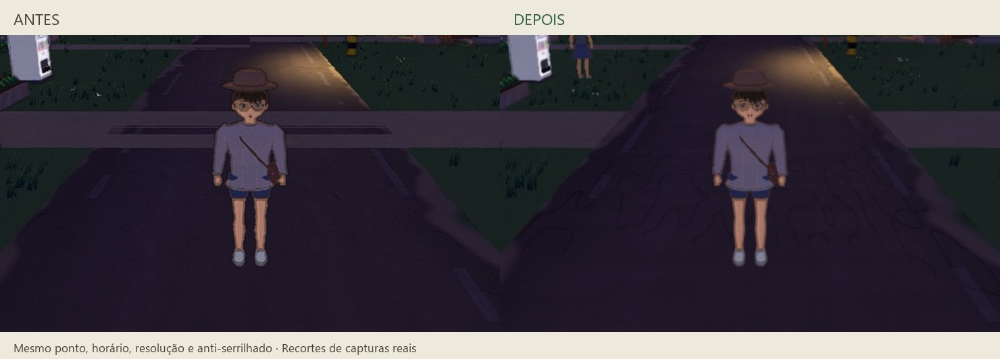
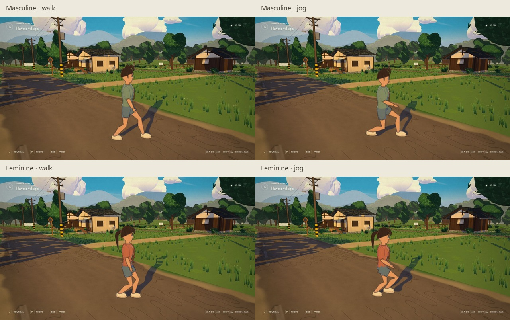

# Movement, ground and rendering polish

Reviewed September 29, 2026. This pass is restricted to movement, animation, visual stability, performance and graphics controls. It does not expand the map or change the wardrobe asset inventory.

## Result

Walking increases from **1.65 to 2.35 m/s** (+42%) and jogging from **3.4 to 4.8 m/s** (+41%). Acceleration, braking and displacement are integrated analytically so ordinary slow frames do not slow the simulation. Suspended-tab gaps are discarded; collision still uses short movement substeps. The camera separates follow smoothing from wall retraction and adds a small movement look-ahead.

The player uses a continuous distance-driven gait over the compatible authored rig: ground-aware foot targets, two-bone leg IK, matched walk/run phase, opposed arms, smooth hip movement and synchronized footstep events. Review caught an unreachable running foot target; the toe-off curve and hip height were corrected to avoid locking the knee. This is a runtime animation refinement, not a new Blender export or motion-capture claim.

The gray stripe was overlapping coplanar dirt and asphalt. Road intersections are now geometrically clipped to share a single surface. Near-plane precision and derivative-filtered road details further reduce crawl. Five real crossing locations each returned exactly one surface in a vertical ray test.

**Low / Medium / High / Ultra** remain independently configurable. Low/Medium now use FXAA and lighter outlines; shadow frequency, foliage shaders and geometry detail are reduced where appropriate. Hidden wardrobe transforms no longer update on every IK solve. The framebuffer is preserved only when a photo is captured.

**Render scenery** offers:

- **As I approach:** a 60–500 m range; scenery recedes into haze, individual grass tufts shrink and tree leaf detail reduces gradually. The opaque tree canopy keeps its shape.
- **Entire landscape:** retains all playable regions and all 249 tree placements in range. Preset density and detail still apply, and normal camera-frustum culling remains active. This costs more GPU time.

Terrain, paths, river and distant mountains stay continuous. Graphics chosen on the title screen also survive reload before character creation. Existing customized settings remain valid; select a preset again to apply its revised defaults.

## Validation

- **22 unit/asset tests passed**, including 5–144 FPS travel consistency, gait continuity, path clipping/UVs, saves and distance visibility.
- **208 browser gameplay checks passed**, including both bodies, wardrobe variants, cycling IK, movement, all interiors, optional activities, routes, NPC schedules, time, sound and PNG photo export. [Report](qa-fluency-browser.json).
- **18 focused browser checks passed** against the actual rigs, road geometry, camera and all four preset controls. [Report](qa-fluency-focused.json). Final sampled ankle-target error was below 1 mm for both bodies through walk/run cycles; this validates the IK target solve, not universal absence of clipping.
- A real reload retained Medium, FXAA, full visibility and the stored 500 m nearby distance, even before character creation. [Report](qa-fluency-storage.json).
- TypeScript checking and the production build passed.
- The compiled normal URL loaded and entered the world, exposed all four quality presets and both visibility modes, and produced no console errors or warnings. The QA API is absent. Existing appearance, activities, position and time were preserved. [Production report](qa-fluency-production.json).

The full browser test requires a genuine initial click for browser audio activation and a fresh world for repeatable NPC/activity state. Initial diagnostic runs exposed those fixture preconditions; the final fresh-world run passed all 208 checks.

## Matched performance comparison

GPU: **Intel UHD Graphics, ANGLE / Direct3D11**. Display **1280 × 720, DPR 1**. Low renders at **896 × 504**, Medium at **1088 × 612**. Each populated-scene sample lasts four seconds after 24 warmup frames. Only one test game was active, with no screenshot during timing. The baseline is the previous production build at `c1d171a`; both versions use their respective complete presets at identical render dimensions. This compares the resulting preset experience, not an equal-feature shader microbenchmark.

[Before](qa-fluency-before.json) · [After](qa-fluency-after.json) · [Repeatable measurement helper](../tests/fluency-review.js)

| Preset | Scene         | Before FPS | After FPS | Gain |
| ------ | ------------- | ---------: | --------: | ---: |
| Low    | town walk     |       24.0 |      35.6 |  48% |
| Low    | Hibiscus run  |       24.2 |      38.9 |  61% |
| Low    | river view    |       25.5 |      41.8 |  64% |
| Low    | home interior |       62.4 |      97.9 |  57% |
| Medium | town walk     |       15.9 |      19.4 |  22% |
| Medium | Hibiscus run  |       15.1 |      20.4 |  35% |

The same walking sample covers about **9.28 m after vs 6.60 m before**, and running about **18.92 m vs 13.51 m**, including acceleration. These are elapsed-time measurements through the real input layer.

At **1920 × 1080, DPR 1**, final Low / nearby measured **28.9 FPS in town** and **31.2 FPS by the river**, internally rendered at 1344 × 756. [1080p report](qa-fluency-1080p.json).

At 720p, Low / full landscape measured **28.0 FPS in town** and **38.4 FPS by the river**, compared with 35.6 / 41.8 FPS in nearby mode. [Full-view report](qa-fluency-full-view.json).

These are short samples on integrated graphics, not a 60 FPS certification or a test of a discrete gaming GPU. Medium measured approximately 19–20 FPS outdoors on this hardware; High/Ultra were functionally and visually checked, not certified for smooth performance on this GPU. The final small gait-reach adjustment followed the matched comparison; the separate 1080p and full-view samples include that adjustment.

## Visual inspection

The paired crops use the same character configuration, position, camera framing, blue-hour time, resolution scale and SMAA setting. The after capture holds the old Low values (0.7 scale, 1024 shadows, 0.35 vegetation, 140 m range) to isolate the repaired ground. The new lighter Low outline pipeline remains active. Separately, the revised default Low uses FXAA for speed; High/Ultra retain MSAA. The broken gray surface is absent in the after image. The continuous intersection was also crossed using live movement and inspected in afternoon light. Long rectangular shadows at golden hour come from the buildings and were isolated from surface overlap during diagnosis.

Pose captures are paused samples of the running game at High, used to inspect knees, feet, sleeves and silhouettes; real movement and transitions were separately exercised through input tests. The style remains simplified and joint-driven, without simulated cloth.

[Full-view settings](screenshots/fluency/graphics-full.png) · [Nearby distance](screenshots/fluency/graphics-nearby.png) · [Crossing after traversal](screenshots/fluency/crossing-in-motion.png)

Test storage and temporary viewport overrides are restored after review.
